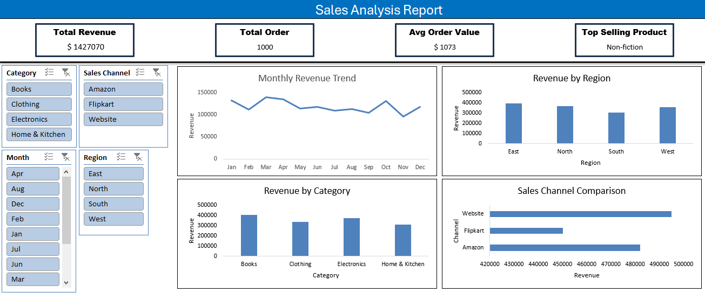

# 📊 Sales Analysis Dashboard (Excel)

This project is a dynamic sales performance dashboard built using Microsoft Excel. It provides key insights into revenue, orders, and product performance using slicers, pivot tables, and interactive visuals.

---

## 🧾 Project Highlights

- ✅ Total Revenue: `$1,427,070`
- ✅ Total Orders: `1,000`
- ✅ Average Order Value: `$1,073`
- ✅ Top Selling Product: **Non-fiction**

---

## 📈 Dashboard Features

| Visual | Purpose |
|--------|---------|
| **Monthly Revenue Trend** | Analyze revenue seasonality month-over-month |
| **Revenue by Region** | Track sales across East, North, South, and West |
| **Revenue by Category** | Evaluate which product categories drive the most revenue |
| **Sales Channel Comparison** | Compare sales across Amazon, Flipkart, and Website |
| **Slicers** | Filter the dashboard by Category, Channel, Region, and Month |

---

## 📂 Files Included

| File | Description |
|------|-------------|
| `Sales_Analysis_Dashboard.xlsx` | Fully interactive Excel dashboard |
| `Final Snap.png` | Snapshot of the dashboard |
| `README.md` | Project documentation |

---

## 🛠️ Tools & Techniques Used

- Microsoft Excel  
- Pivot Tables  
- Interactive Slicers  
- Line & Bar Charts  
- Custom KPIs

---

## 📌 Use Cases

- Business performance review
- E-commerce channel analysis
- Product category trend tracking
- Executive sales summary for decision-making

---

## 🧑‍💻 Author

**Sarthak Nade**

---

## 📷 Dashboard Preview

---

